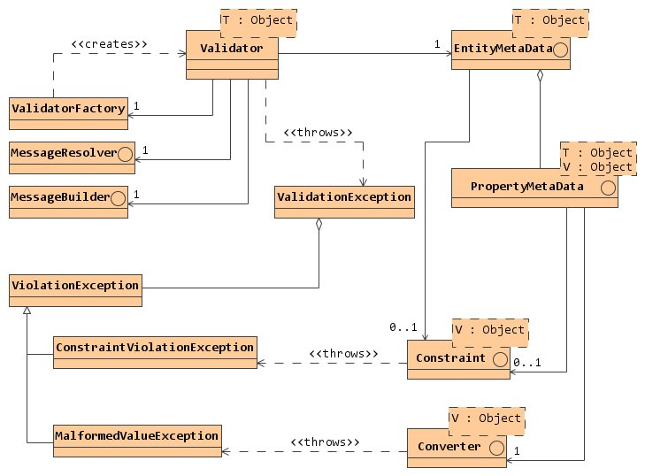

## Introduction
    
This validation framework does not implement the [JSR-303](https://jcp.org/aboutJava/communityprocess/final/jsr303/index.html)
specification. The main features of this implementation are:

- Ability to modify (correct) test values.
- Support for validation of localized values.
- Conversion of values into and from text representation.
- Formating of error messages, depending on the context.
- Support for metadata, which allows to check any entity types.
- Long list of predefined validation components.
- Good opportunities for expansion.

In chapters 3 and 4, you will find detailed information on all of the above features.

## Getting Started

In this chapter, we consider a simple example that will give basic knowledge on the
use of this framework. For this you need [JDK](https://www.oracle.com/technetwork/java/javase/downloads/index.html)
1.6 or higher and [Apache Maven](https://maven.apache.org/).

### Maven Setup

In the `pom.xml` file you need to add the following dependency:
            
```xml
<dependencies>
    <dependency>
        <groupId>org.foxlabs</groupId>
        <artifactId>foxlabs-validation</artifactId>
        <version>1.0</version>
    </dependency>
</dependencies>
```

No other dependencies are required.
    
### Writing Bean
        
Lets create an `Account` class:
                
```java
import org.foxlabs.validation.constraint.*;

public class Account {
    
    private Long id;
    private String username;
    private String email;
    private String password;
    
    @NotNull
    public Long getId() {
        return id;
    }
    
    public void setId(Long id) {
        this.id = id;
    }
    
    @Coalesce @NotEmpty
    public String getUsername() {
        return username;
    }
    
    public void setUsername(String username) {
        this.username = username;
    }
    
    @Despace @NotEmpty @EmailAddress
    public String getEmail() {
        return email;
    }
    
    public void setEmail(String email) {
        this.email = email;
    }
    
    @NotEmpty @Size(min = 6, max = 32)
    public String getPassword() {
        return password;
    }
    
    public void setPassword(String password) {
        this.password = password;
    }
    
}
```

Here you define the following constraints:

- `id` should never be `null`.
- `username` should never be empty, all extra whitespaces will be removed.
- `email` should be non-empty valid email address, all whitespaces will be removed.
- `password` should be non-empty with length from 6 to 32 characters.

### Validating Bean

In order to validate bean you need a few lines of code.
            
```java
Account account = new Account();
account.setId(1L);
account.setUsername("Fox Mulder");
account.setEmail("foxinboxx@gmail.com");
account.setPassword("The truth is out there");

Validator<Account> validator = ValidatorFactory.getDefault().newValidator(Account.class);
try {
    validator.validateEntity(account);
} catch (ValidationException e) {
    e.printViolations();
}
```

In the example above, we create a new `Account`, initialize its properties and
perform validation. All violations will be printed to the `System.err`. You can
experiment with the values ​​of the properties to see validation results.

## Architecture

On the following class diagram you will see the key classes of this framework.



Next sections describe all these classes in more details.

### Validation Components

Validation components are basic blocks of this framework. The [Validation](api/org/foxlabs/validation/Validation.html)
interface defines generic abstraction of the validation component. For the moment
there are two component types: [Constraint](api/org/foxlabs/validation/constraint/Constraint.html)
and [Converter](api/org/foxlabs/validation/converter/Converter.html).

The [ValidationContext](api/org/foxlabs/validation/ValidationContext.html) interface
provides information about current validation state to the components. Implementation
of that interface passed to all validation methods of the components.

The [Constraint](api/org/foxlabs/validation/constraint/Constraint.html) interface
defines component, suitable for check whether a test value conforms to some rules or not.
Also it allows to modify (correct) test value if it is possible. If for some reason
test value doesn't fit the validation rules and it cannot be corrected then the result
of validation should be [ConstraintViolationException](api/org/foxlabs/validation/constraint/ConstraintViolationException.html).
In other cases constraint should return (possibly modified) test value.

The [Converter](api/org/foxlabs/validation/converter/Converter.html) interface defines
component, suitable for convert value to and from text representation. If for some
reason value cannot be converted from string representation then the result of conversion
should be [MalformedValueException](api/org/foxlabs/validation/converter/MalformedValueException.html).
Conversion of a value to string representation doesn't assume any exceptions.
The [ValidationContext.isLocalizedConvert()](api/org/foxlabs/validation/ValidationContext.html#isLocalizedConvert())
method specifies if localized representation is required.

### Validation Messages

Validation component may provide error message that will be used when validation process fails.
That message may depend on validation context or component parameters. Because of that
[Validation](api/org/foxlabs/validation/Validation.html) interface defines two methods that
allow to obtain required information for error message generation. The
[Validation.getMessageTemplate()](api/org/foxlabs/validation/Validation.html#getMessageTemplate(org.foxlabs.validation.ValidationContext))
method allows to obtain localized error message template. The
[Validation.appendMessageArguments()](api/org/foxlabs/validation/Validation.html#appendMessageArguments(org.foxlabs.validation.ValidationContext, java.util.Map))
method provides arguments to be substituted into the error message template. Locale of the
error message and its arguments should be obtained from the
[ValidationContext.getMessageLocale()](api/org/foxlabs/validation/ValidationContext.html#getMessageLocale()) method.

The [MessageResolver](api/org/foxlabs/validation/message/MessageResolver.html) is used
for resolving localized message templates. That abstraction allows to store error messages
anywhere. By default `org/foxlabs/validation/resource/validation-messages`
resource bundle is used. Validation components could use
[ValidationContext.resolveMessage()](api/org/foxlabs/validation/ValidationContext.html#resolveMessage(java.lang.String))
to obtain error message templates. Fully qualified class name of the validation component
is usually used as message key.

Having localized error message template and its arguments, goal of the
[MessageBuilder](api/org/foxlabs/validation/message/MessageBuilder.html) is to build
error message. By default the [DefaultMessageBuilder](api/org/foxlabs/validation/message/DefaultMessageBuilder.html)
is used.

### Validation Exceptions

Each validation component can throw [ViolationException](api/org/foxlabs/validation/ViolationException.html)
that contains necessary information about validation state on the moment of violation,
invalid value and source component which generates exception. In case of multiple violations the
[ValidationException](api/org/foxlabs/validation/ValidationException.html) represents full stack
of violations with detailed information about each violation.

Errors in the validation component declaration propagated as the
[ValidationDeclarationException](api/org/foxlabs/validation/ValidationDeclarationException.html)
and its subclasses.

### Entity Metadata

Metadata needed to describe the entity and its properties, constraints and converters imposed on them.

The [EntityMetaData](api/org/foxlabs/validation/metadata/EntityMetaData.html) interface defines
entity metadata. The [PropertyMetaData](api/org/foxlabs/validation/metadata/PropertyMetaData.html)
interface defines property metadata. For Java Beans and POJOs there is the
[BeanMetaData](api/org/foxlabs/validation/metadata/BeanMetaData.html) class that allows to
gather all information about entity from annotations.
The [MapMetaData](api/org/foxlabs/validation/metadata/MapMetaData.html) class can be used
to describe metadata for validation of the `java.util.Map` entities.

### Validator And Its Factory

All architecture components binded together through the [Validator](api/org/foxlabs/validation/Validator.html)
class. That class has a set of shortcut methods to perform validation with default parameters.
If other configuration is required then the [Validator.newContext()](api/org/foxlabs/validation/Validator.html#newContext())
method should be used. Returned [Validator.ContextBuilder](api/org/foxlabs/validation/Validator.ContextBuilder.html)
instance allows to configure validation parameters as you need.

To create a new validator the [ValidatorFactory](api/org/foxlabs/validation/ValidatorFactory.html)
should be used. The main purpose of that factory is maintaining validators configuration.
You can configure factory once and then create validators with different metadata.

```java
...
ValidatorFactory factory = ValidatorFactory.getDefault();
Validator<Account> validator = factory.newValidator(Account.class);
Validator<Account>.ContextBuilder context = validator.newContext();
context.setLocale(Locale.ROOT).setFailFast(true).validateEntity(account);
...
```

### Validating Groups

Validating groups are string identifiers that can be applied to constraints only and
allow to check certain constraints defined on the element. If constraint is not binded
to any validating group then it will be binded to default group (empty string) automatically.
By default validation will be performed for all defined constraints.

The [Validator.ContextBuilder.setValidatingGroups()](api/org/foxlabs/validation/Validator.ContextBuilder.html#setValidatingGroups(java.lang.String...))
method allows to change validating groups.
            
```java
...
Validator<Account>.ContextBuilder context = validator.newContext();
context.setValidatingGroups("correct", "update").validateEntity(account);
...
```

## Annotations

For Java Beans and POJOs validation components can be defined through annotations.

### Constraint Annotations

Each constraint annotation should be annotated by the [@ConstrainedBy](api/org/foxlabs/validation/constraint/ConstrainedBy.html)
annotation that specifies constraint implementation classes. Also constraint annotation
can define the following elements:

- The `message` property of the `java.lang.String` type. This property allows to
  override default error message template of the constraint.
- The `groups` property of the `java.lang.String[]` type. This property defines
  validating groups the constraint is applied on.
- The `targets` property of the [ValidationTarget[]](api/org/foxlabs/validation/ValidationTarget.html)
  type. This property defines an object part to which constraint should be applied.
- The inner `@List` annotation with `value` property of the outer constraint annotation
  array type. This annotation allows to apply outer constraint annotation several times on
  the same element.

For example, you can take a look at the [@NotNull](api/org/foxlabs/validation/constraint/NotNull.html) annotation.

There are several specific annotations.

| Annotation                                                             | Description                                                        |
|------------------------------------------------------------------------|--------------------------------------------------------------------|
| [@Composition](api/org/foxlabs/validation/constraint/Composition.html) | Defines composition (AND) of constraints of the annotated element. |
| [@Conjunction](api/org/foxlabs/validation/constraint/Conjunction.html) | Defines conjunction (AND) of constraints of the annotated element. |
| [@Disjunction](api/org/foxlabs/validation/constraint/Disjunction.html) | Defines disjunction (OR) of constraints of the annotated element.  |
| [@Negation](api/org/foxlabs/validation/constraint/Negation.html)       | Defines negation (NOT) of constraints of the annotated element.    |

```java
@NotNull @NotEmpty
@Url(targets = ValidationTarget.ELEMENTS)
@EmailAddress(targets = ValidationTarget.ELEMENTS)
@Disjunction(targets = ValidationTarget.ELEMENTS)
public List<String> getContactList() {
    ...
}
```

In the example above we define constraint for `java.util.List` property type.
This list cannot be `null` or empty, each element of the list must be a well-formed
URL or email address.

> Also elements of the list in example above can be `null` because
> [@Url](api/org/foxlabs/validation/constraint/Url.html) and
> [@EmailAddress](api/org/foxlabs/validation/constraint/EmailAddress.html)
> constraints allow `null`s.

### Converter Annotations

Each converter annotation should be annotated by the [@ConvertedBy](api/org/foxlabs/validation/converter/ConvertedBy.html)
annotation that specifies converter implementation classes. Also converter annotation
can define the following elements:

- The `message` property of the `java.lang.String` type. This property allows to
  override default error message template of the converter.
- The `targets` property of the [ValidationTarget[]](api/org/foxlabs/validation/ValidationTarget.html)
  type. This property defines an object part to which converter should be applied.
- The inner `@List` annotation with `value` property of the outer converter annotation
  array type. This annotation allows to apply outer converter annotation several times on
  the same element.

For example, you can take a look at the [@NumberPattern](api/org/foxlabs/validation/converter/NumberPattern.html)
annotation.

```java
@DateStyle(date = DateFormat.SHORT)
public Date getCurrentDate() {
    ...
}
```            

In the example above we define converter for `java.util.Date` property type with the specified date style.

> Also you can use converter annotations in conjunction with the
> [Tokenizer](api/org/foxlabs/validation/converter/Tokenizer.html) annotations for arrays,
> `java.util.Collection` and `java.util.Map` types (for example, you can use the
> [@TokenDelimiters](api/org/foxlabs/validation/converter/TokenDelimiters.html) annotation).

### Custom Annotations

Custom annotations are annotations constructed from other annotations. Custom annotations
must not be annotated by the [@ConstrainedBy](api/org/foxlabs/validation/constraint/ConstrainedBy.html)
or [@ConvertedBy](api/org/foxlabs/validation/converter/ConvertedBy.html) annotations.

Lets create custom constraint annotation that will check whether the specified string
is well-formed URL or email address.

```java
import java.lang.annotation.Target;
import java.lang.annotation.ElementType;
import java.lang.annotation.Retention;
import java.lang.annotation.RetentionPolicy;

import org.foxlabs.validation.ValidationTarget;

@Retention(RetentionPolicy.RUNTIME)
@Target({ElementType.TYPE, ElementType.METHOD, ElementType.FIELD})
@Disjunction @Url @EmailAddress
public @interface ContactAddress {
    
    String message() default "";
    
    String[] groups() default {};
    
    ValidationTarget[] targets() default {};
    
    @Retention(RetentionPolicy.RUNTIME)
    @Target({ElementType.TYPE, ElementType.METHOD, ElementType.FIELD})
    public static @interface List {
        
        ContactAddress[] value();
        
    }
    
}
```

Now you can apply `@ContactAddress` annotation for any property of the string type.

## Customization

In this chapter, we will consider opportunities to customize components of the proposed framework.

### Implementing Your Own Constraint

To define a new constraint you need to implement the [Constraint](api/org/foxlabs/validation/constraint/Constraint.html)
interface. Depending on what kind of constraint you need to, you can use one of the existing classes.

| Class                                                                                                         | Description                                                                                                                                                     |
|---------------------------------------------------------------------------------------------------------------|-----------------------------------------------------------------------------------------------------------------------------------------------------------------|
| [CorrectConstraint](api/org/foxlabs/validation/constraint/CorrectConstraint.html)                             | Allows to modify (correct) test value and never throws [ConstraintViolationException](api/org/foxlabs/validation/constraint/ConstraintViolationException.html). |
| [CheckConstraint](api/org/foxlabs/validation/constraint/CheckConstraint.html)                                 | Only checks a test value and doesn't modify it.                                                                                                                 |
| [RegexConstraint](api/org/foxlabs/validation/constraint/RegexConstraint.html)                                 | Checks whether a test string matches the regular expression.                                                                                                    |
| [EnumerationConstraint](api/org/foxlabs/validation/constraint/EnumerationConstraint.html)                     | Checks whether a test value is one of the allowed constants.                                                                                                    |
| [IgnoreCaseEnumerationConstraint](api/org/foxlabs/validation/constraint/IgnoreCaseEnumerationConstraint.html) | Checks whether a test string is one of the allowed strings using ignore case comparison.                                                                        |
| [SizeConstraint](api/org/foxlabs/validation/constraint/SizeConstraint.html)                                   | Checks whether the size of a test value is within allowed minimum and maximum bounds.                                                                           |

> You can also extend the [AbstractValidation](api/org/foxlabs/validation/AbstractValidation.html)
> class in conjunction with [Constraint](api/org/foxlabs/validation/constraint/Constraint.html) interface.

Lets implement `StartsWithConstraint` that will check whether a test string starts with some prefix.

```java
import org.foxlabs.validation.ValidationContext;
import org.foxlabs.validation.constraint.CheckConstraint;

import org.foxlabs.util.Assert;

public class StartsWithConstraint extends CheckConstraint<String> {
    
    private final String prefix;
    
    public StartsWithConstraint(String prefix) {
        this.prefix = Assert.notEmpty(prefix, "Prefix cannot be null or empty!");
    }
    
    @Override
    public Class<?> getType() {
        return String.class;
    }
    
    @Override
    public boolean appendMessageArguments(ValidationContext<?> context, Map<String, Object> arguments) {
        super.appendMessageArguments(context, arguments);
        arguments.put("prefix", prefix);
        return true;
    }
    
    @Override
    protected <T> boolean check(String value, ValidationContext<T> context) {
        return value == null || value.startsWith(prefix);
    }
    
}
```

> Don't forget to add constraint error message template in the default message bundle (see [Validation Messages](#validation-messages))).

If you plan to use `StartsWithConstraint` for validating Java beans or POJOs then you need to
define constraint annotation and add corresponding constructor in the constraint implementation class.

```java
import java.lang.annotation.Target;
import java.lang.annotation.ElementType;
import java.lang.annotation.Retention;
import java.lang.annotation.RetentionPolicy;

import org.foxlabs.validation.ValidationTarget;
import org.foxlabs.validation.constraint.ConstrainedBy;

@Retention(RetentionPolicy.RUNTIME)
@Target({ElementType.ANNOTATION_TYPE, ElementType.METHOD, ElementType.FIELD})
@ConstrainedBy(StartsWithConstraint.class)
public @interface StartsWith {
    
    String value(); // prefix
    
    String message() default "";
    
    String[] groups() default {};
    
    ValidationTarget[] targets() default {};
    
    @Retention(RetentionPolicy.RUNTIME)
    @Target({ElementType.ANNOTATION_TYPE, ElementType.METHOD, ElementType.FIELD})
    public static @interface List {
        
        StartsWith[] value();
        
    }
    
}
```

Also you need to change `StartsWithConstraint`.
                
```java
...

public class StartsWithConstraint extends CheckConstraint<String> {
    
    ...
    
    public StartsWithConstraint(StartsWith annotation) {
        this(annotation.value());
    }
    
    ...
    
}
```

That's it. Now you can apply `@StartsWith` annotation for any property of the string type.

### Implementing Your Own Converter

To define a new converter you need to implement the [Converter](api/org/foxlabs/validation/converter/Converter.html)
interface.

> You can extend the [AbstractConverter](api/org/foxlabs/validation/converter/AbstractConverter.html)
> class or [AbstractValidation](api/org/foxlabs/validation/AbstractValidation.html) class in conjunction
> with [Converter](api/org/foxlabs/validation/converter/Converter.html) interface.

Lets implement `RgbColorConverter` that will convert `#RRGGBB` color text representation
into the `java.awt.Color` and vice versa.

```java
import java.awt.Color;

import org.foxlabs.validation.ValidationContext;
import org.foxlabs.validation.converter.AbstractConverter;
import org.foxlabs.validation.converter.MalformedValueException;

public class RgbColorConverter extends AbstractConverter<Color> {
    
    @Override
    public Class<Color> getType() {
        return Color.class;
    }
    
    @Override
    protected <T> Color doDecode(String value, ValidationContext<T> context) {
        if (value.length() == 7 && value.charAt(0) == '#') {
            try {
                int r = Integer.parseInt(value.substring(1, 3), 16);
                int g = Integer.parseInt(value.substring(3, 5), 16);
                int b = Integer.parseInt(value.substring(5, 7), 16);
                
                return new Color(r, g, b);
            } catch (NumberFormatException e) {}
        }
        throw new MalformedValueException(this, context, value);
    }
    
    @Override
    protected <T> String doEncode(Color value, ValidationContext<T> context) {
        StringBuilder rgb = new StringBuilder(7);
        rgb.append('#');
        
        String r = Integer.toHexString(value.getRed());
        if (r.length() < 2) {
            rgb.append('0');
        }
        rgb.append(r);
        
        String g = Integer.toHexString(value.getGreen());
        if (g.length() < 2) {
            rgb.append('0');
        }
        rgb.append(g);
        
        
        String b = Integer.toHexString(value.getBlue());
        if (b.length() < 2) {
            rgb.append('0');
        }
        rgb.append(b);
        
        return rgb.toString();
    }
    
}
```

> Don't forget to add converter error message template in the default message bundle (see [Validation Messages](#validation-messages)).

If you want to use `RgbColorConverter` as default converter for `java.awt.Color` value types you
need to register it in the [ConverterFactory](api/org/foxlabs/validation/converter/ConverterFactory.html).

```java
ConverterFactory.addDefaultConverter(new RgbColorConverter());
```

But if you want to use `RgbColorConverter` for Java Beans or POJOs and you have
different converters for `java.awt.Color` type or you want to parameterize your
`RgbColorConverter` (for example, you may want to encode colors in upper or lower case)
then you need an annotation.

```java
import java.lang.annotation.Target;
import java.lang.annotation.ElementType;
import java.lang.annotation.Retention;
import java.lang.annotation.RetentionPolicy;

import org.foxlabs.validation.ValidationTarget;
import org.foxlabs.validation.converter.ConvertedBy;

@Retention(RetentionPolicy.RUNTIME)
@Target({ElementType.ANNOTATION_TYPE, ElementType.METHOD, ElementType.FIELD})
@ConvertedBy(RgbColorConverter.class)
public @interface RgbColor {
    
    boolean upperCase() default true; // encoding parameter
    
    String message() default "";
    
    ValidationTarget[] targets() default {};
    
    @Retention(RetentionPolicy.RUNTIME)
    @Target({ElementType.ANNOTATION_TYPE, ElementType.METHOD, ElementType.FIELD})
    public static @interface List {
        
        RgbColor[] value();
        
    }
    
}
```

Also you need to change the `RgbColorConverter`.

```java
...

public class RgbColorConverter extends AbstractConverter<Color> {
    
    private final boolean upperCase;
    
    public RgbColorConverter(boolean upperCase) {
        this.upperCase = upperCase;
    }
    
    public RgbColorConverter(RgbColor annotation) {
        this(annotation.upperCase());
    }
    
    ...
    
    @Override
    protected <T> String doEncode(Color value, ValidationContext<T> context) {
        ...
        
        String text = rgb.toString();
        return upperCase ? text.toUpperCase() : text.toLowerCase();
    }
    
}
```

That's it. Now you can apply `@RgbColor` annotation for any property of the `java.awt.Color` type.

### Customizing Other Components

In most cases you don't need to customize anything in this framework except
[Constraint](api/org/foxlabs/validation/constraint/Constraint.html) and
[Converter](api/org/foxlabs/validation/converter/Converter.html). But in some cases you may need
to customize [EntityMetaData](api/org/foxlabs/validation/metadata/EntityMetaData.html),
[MessageResolver](api/org/foxlabs/validation/message/MessageResolver.html) or
[MessageBuilder](api/org/foxlabs/validation/message/MessageBuilder.html) and even
[ValidatorFactory](api/org/foxlabs/validation/ValidatorFactory.html).

#### Extending Metadata

Extending metadata is required when your entities is not represented as Java Beans or POJOs,
or you define entities or properties by other criteria (for example, you can have `@Property`
annotation to define entity properties). To define your own metadata you can use existing
abstract classes.

| Class                                                                                         | Description                                            |
|-----------------------------------------------------------------------------------------------|--------------------------------------------------------|
| [AbstractEntityMetaData](api/org/foxlabs/validation/metadata/AbstractEntityMetaData.html)     | Provides base implementation of the entity metadata.   |
| [AbstractPropertyMetaData](api/org/foxlabs/validation/metadata/AbstractPropertyMetaData.html) | Provides base implementation of the property metadata. |

After you defined your own metadata, it can be used to create validators.

```java
EntityMetaData<T> myMeta = ...
ValidatorFactory factory = ...
Validator<T> validator = factory.newValidator(myMeta);
```

#### Extending Message Resolver And Builder

If your error message templates is not stored as Java resources (for example,
they can be stored in the database) then you need to provide your own
[MessageResolver](api/org/foxlabs/validation/message/MessageResolver.html) and
initialize your [ValidatorFactory](api/org/foxlabs/validation/ValidatorFactory.html).

```java
MessageResolver resolver = ...
ValidatorFactory factory = ...
factory.setMessageResolver(resolver);
```

Also you may want to store your error message templates in another Java resource bundle. If so then
you need to tell about that to [ValidatorFactory](api/org/foxlabs/validation/ValidatorFactory.html).
                
```java
ValidatorFactory myFactory = new ValidatorFactory("my/message/bundle/name");
```

> The [MessageResolverChain](api/org/foxlabs/validation/message/MessageResolverChain.html) class
> can be used to create a chain of the [MessageResolver](api/org/foxlabs/validation/message/MessageResolver.html)s.

The goal of the [MessageBuilder](api/org/foxlabs/validation/message/MessageBuilder.html) is to render
error message templates for the current [ValidationContext](api/org/foxlabs/validation/ValidationContext.html)
and message arguments provided by the validation components.
The [DefaultMessageBuilder](api/org/foxlabs/validation/message/DefaultMessageBuilder.html) is used by
default to render message templates. If you need more sophisticated message renderer then you should
provide your own [MessageBuilder](api/org/foxlabs/validation/message/MessageBuilder.html) implementation
(for example, you can use one of template engines to render messages) and tell about that to
[ValidatorFactory](api/org/foxlabs/validation/ValidatorFactory.html).

```java
MessageBuilder builder = ...
ValidatorFactory factory = ...
factory.setMessageBuilder(builder);
```

> You can also extend the [AbstractMessageBuilder](api/org/foxlabs/validation/message/AbstractMessageBuilder.html)
> abstract class to provide your own implementation.

#### Extending Validator Factory

The main goal for extending [ValidatorFactory](api/org/foxlabs/validation/ValidatorFactory.html)
is to provide additional configuration to the [Validator](api/org/foxlabs/validation/Validator.html).
After, these configuration parameters can be accessed in the validation components. The right way is
to extend [Validator](api/org/foxlabs/validation/Validator.html) too, because factory configuration
is supposed as mutable.

## Constrained Map

This validation framework is not tied only to validating Java Beans or POJOs. You can validate any
entity having [EntityMetaData](api/org/foxlabs/validation/metadata/EntityMetaData.html) descriptor.
So it is a good idea to validate `java.util.Map` entities.

The [ConstrainedMap](api/org/foxlabs/validation/ConstrainedMap.html) class allows to maintain
a set of properties with constraints. It also provides modifications in transaction-like manner
and convertation of property values into and from string representation. More over, this class
is thread-safe and suitable for maintaining configuration properties in multithreaded environment
such as web application.

The following example will show how you can create such map.

```java
import org.foxlabs.validation.ConstrainedMap;
import org.foxlabs.validation.ValidatorFactory;
import org.foxlabs.validation.metadata.MapMetaData;

import static org.foxlabs.validation.constraint.ConstraintFactory.*;

@SuppressWarnings("unchecked")
public class Configuration {
    
    public static final ConstrainedMap SETTINGS;
    
    static {
        MapMetaData.Builder builder = new MapMetaData.Builder();
        
        builder.property("admin.email", String.class, join(despace(), notBlank(), emailAddress()), "x@y.z")
               .property("session.timeout", Integer.class, join(notNull(), range(10, 1440)), 30)
               .property("output.encoding", String.class, supportedEncoding(), "ISO-8859-1");
        
        SETTINGS = new ConstrainedMap(ValidatorFactory.getDefault().newValidator(builder.build()));
    }
    
}
```

In the example above, we build `SETTINGS` map with 3 constrained properties.

The next step is to modify values.

```java
// changing single property
try {
    Configuration.SETTINGS.setValue("session.timeout", 60);
} catch (ValidationException e) {
    e.printViolations();
}

// changing multiple properties
ConstrainedMap.Transaction tx = Configuration.SETTINGS.newTransaction();
tx.setValue("admin.email", "foxinboxx@gmail.com");
tx.setValue("session.timeout", 5);
tx.setValue("output.encoding", "UTF-8");
try {
    tx.commit(false);
    System.out.println(Configuration.SETTINGS);
} catch (ValidationException e) {
    e.printViolations();
```

> [ConstrainedMap](api/org/foxlabs/validation/ConstrainedMap.html) validates property values
> internally when you change them. So if you need to change multiple properties it is better
> to use transaction. Also transaction needed if you want to read a number of properties and
> avoid inconsistency in multithreaded environment.

If you need to store (or restore) property values in a file or stream the code below can be helpful.

```java
File file = new File("settings.properties");
Configuration.SETTINGS.save(file, "My configuration");
try {
    Configuration.SETTINGS.load(file);
} catch (ValidationException e) {
    e.printViolations();
}
```
